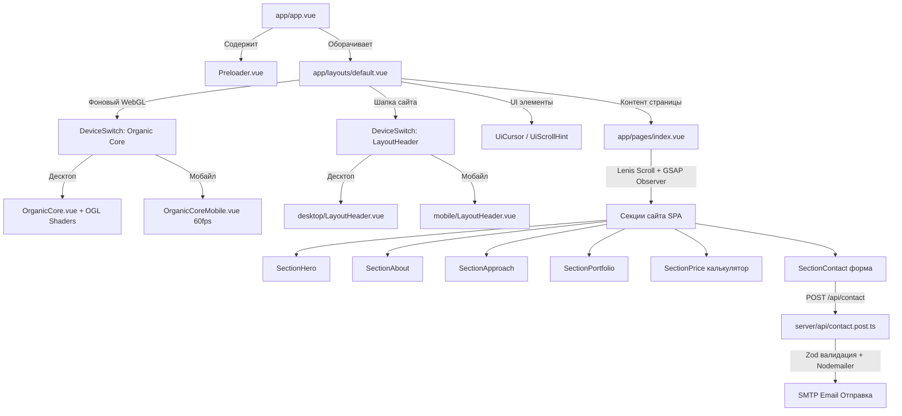

# 🏛 Архитектурный план и карта кодовой базы проекта `studio-BLACK`

> **Назначение документа:** Данный файл является исчерпывающим архитектурным справочником и навигатором по кодовой базе проекта **studio-BLACK**. Он создан специально для ИИ-ассистентов (нейросетей) и разработчиков, чтобы обеспечить мгновенное понимание структуры, системных правил и роли каждого файла в проекте.

---

## 🏗 1. Глобальный архитектурный план (Парадигма проекта)

Проект представляет собой премиальное одностраничное веб-приложение (SPA-лендинг) цифровой студии **KVAZAR**, построенное на современном стеке **Nuxt 4 + Vue 3.5+ (Composition API) + TypeScript (Strict No-Any) + Tailwind CSS v4 + WebGL (OGL) + GSAP 3 + Lenis**.

### 🌟 Ключевые архитектурные паттерны:

1. **Device-Split (Физическое разделение UI по устройствам):**
   - Вместо громоздких и тяжелых CSS медиа-запросов (`@media`), перегружающих DOM, UI строго разделен на две независимые ветки компонентов: `desktop/` и `mobile/`.
   - Выбор ветки происходит во время выполнения через глобальный компонент `<DeviceSwitch>`, использующий определение устройства из `useDeviceSwitch()`.
   - Это гарантирует 60fps на тач-устройствах за счет отключения тяжелых ховер-эффектов, упрощения математики шейдеров и адаптации интерактивных зон (минимум 44x44px).

2. **Strict-Cleanup (Жесткое управление жизненным циклом и памятью):**
   - Каждая анимация GSAP (`gsap.to`, `Timeline`, `ScrollTrigger`), каждый слушатель (`window.addEventListener`), таймер (`setTimeout`, `setInterval`, `requestAnimationFrame`) и подписка на Event Bus (`useEventBus().on`) гарантированно уничтожаются в хуке `onBeforeUnmount`.
   - Этот критерий является жестким требованием при любых изменениях кодовой базы для предотвращения утечек памяти.

3. **Органическое 3D-ядро (Organic Core WebGL / OGL):**
   - В фоне приложения (`app/layouts/default.vue`) постоянно работает легковесный WebGL-холст на базе библиотеки **OGL** (`<OrganicCore>`).
   - Ядро представляет собой жидкую/органическую 3D-амебу, которая плавно морфирует (изменяет форму, цвет и шейдерные искажения) при переходе между 6 секциями сайта.
   - Синхронизация скролла Lenis и морфинга осуществляется через `useOrganicSync` и Event Bus.

4. **Унифицированная система переходов контента (Reveal / Section Transition):**
   - Переключение секций контролируется через CSS-переменные (`--reveal-shift`, `--reveal-dur-in`, `--reveal-dur-out`) и хук `useSectionReveal`. Анимируются исключительно GPU-friendly свойства (`opacity` и `transform`).

---

## 🗺 2. Схема взаимодействия компонентов (Data & Render Flow)

---

## 🗂 3. Полный реестр файлов кодовой базы

Ниже приведено описание **каждого файла** в проекте с указанием пути относительно корня репозитория и его точной архитектурной задачи.

### ⚙️ Конфигурация проекта и корень репозитория

| Файл | Описание и архитектурная роль |
| :--- | :--- |
| `package.json` | Манифест проекта и зависимости. Содержит скрипты сборки (`dev`, `build`, `typecheck`, `lint`) и список библиотек: Nuxt 4, Vue 3.5, Tailwind CSS v4, GSAP, Lenis, OGL, Nodemailer, Zod. |
| `nuxt.config.ts` | Главный конфигурационный файл Nuxt 4. Настраивает Tailwind v4 Vite-плагин, Google Fonts (Wix Madefor), Content Security Policy (через `nuxt-security`), параметры SMTP-сервера в `runtimeConfig` и анимации перехода между страницами. |
| `tsconfig.json` | Конфигурация TypeScript. Настроена на строгий режим проверки типов, наследуя сгенерированные Nuxt настройки из `.nuxt/tsconfig.json`. Абсолютный запрет на тип `any`. |
| `eslint.config.mjs` | Конфигурация линтера ESLint (`@nuxt/eslint`) для автоматического контроля стандартов кода в Vue и TypeScript файлах. |
| `README.md` | Базовая документация со стандартными командами запуска (`npm run dev`, `npm run build`). |
| `gemini.md` | **Высший приоритет для ИИ.** Свод жестких системных правил студии (Strict-Cleanup, Device-Split, No-Any, алгоритм рефакторинга и предотвращение частых ошибок). |
| `points.json` | Прерассчитанный JSON-массив с координатами `(x, y)` и дистанциями. Используется в математических расчетах траекторий или геометрии шейдеров/форм без нагрузки на CPU. |
| `.env.example` | Пример переменных окружения для настройки почтового SMTP-сервера (`SMTP_HOST`, `SMTP_USER`, `SMTP_PASS`, `MAIL_TO`). |

---

### 🎨 Корневые файлы приложения (`app/`)

| Файл | Описание и архитектурная роль |
| :--- | :--- |
| `app/app.vue` | Точка входа в UI. Рендерит `<Preloader />` и `<NuxtLayout>`, задает SEO-метатеги страницы (`useHead`) и определяет глобальные CSS-переменные для анимаций появления/исчезновения (`.reveal-item`, `.reveal-scope-mobile`). |
| `app/layouts/default.vue` | Главный макет (Layout). Монтирует фоновый WebGL-шейдер `<OrganicCore>`, шапку `<LayoutHeader>`, кастомный курсор `<UiCursor>` и подсказку скролла `<UiScrollHint>`. Слушает глобальные события навигации. |
| `app/pages/index.vue` | Главная одностраничная страница лендинга. Управляет скроллом по 6 секциям через Lenis и GSAP Observer, отвечает за ленивую загрузку (`LazySections...`), блокировку скролла во время анимаций и синхронизацию с 3D-ядром. |
| `app/assets/css/main.css` | Глобальный файл стилей проекта. Импортирует Tailwind CSS v4 и определяет базовые сбросы стилей для гладкого отображения верстки. |

---

### 🧩 Компоненты (`app/components/`)

#### Основные компоненты верхнего уровня
| Файл | Описание и архитектурная роль |
| :--- | :--- |
| `app/components/DeviceSwitch.vue` | Ключевой компонент реализации **Device-Split**. Принимает слоты или пропсы и динамически рендерит десктопную либо мобильную версию компонента на основе `useDeviceSwitch()`. |
| `app/components/LogoKvazar.vue` | Векторный интерактивный логотип студии KVAZAR с плавными анимациями элементов. |
| `app/components/LogoText.vue` | Текстовая часть логотипа студии с фирменной типографикой. |
| `app/components/MobileRotateNotice.vue` | Экран-уведомление для мобильных устройств, предупреждающий о ландшафтной ориентации или некорректном размере экрана. |
| `app/components/OrganicCore.vue` | Десктопный WebGL-холст. Инициализирует OGL рендерер, шейдеры и управляет плавным 60fps морфингом органической 3D-фигуры в зависимости от положения мыши и активной секции. |
| `app/components/OrganicCoreMobile.vue` | Облегченная версия WebGL-ядра для смартфонов и планшетов, оптимизированная под мобильные графические чипы и тач-события. |
| `app/components/Preloader.vue` | Экран начальной загрузки сайта. Отображается до полной инициализации шрифтов и первой отрисовки WebGL-ядра, после чего плавно растворяется. |
| `app/components/UiButton.vue` | Универсальный интерактивный UI-компонент кнопки с магнитными/кинетическими эффектами наведения и полной поддержкой accessibility (`role="button"`, `@keydown.enter`). |
| `app/components/UiCursor.vue` | Кастомный десктопный курсор, следующий за мышью с плавным инерционным сглаживанием и реагирующий на кликабельные элементы (увеличение, изменение формы). |
| `app/components/UiKineticText.vue` | Компонент кинетической типографики для создания динамично реагирующих на мышь или скролл текстовых заголовков. |
| `app/components/UiScrollHint.vue` | Визуальный индикатор (подсказка) внизу экрана, побуждающий пользователя начать скролл лендинга. |

#### Десктопные компоненты (`app/components/desktop/`)
| Файл | Описание и архитектурная роль |
| :--- | :--- |
| `app/components/desktop/LayoutHeader.vue` | Десктопная шапка сайта с полной навигацией по секциям сайта, логотипом и интерактивными эффектами. |
| `app/components/desktop/PhysicsMenu.vue` | Выпадающее/интерактивное меню с реалистичной физикой пружин при наведении и взаимодействии с пунктами. |

#### Мобильные компоненты (`app/components/mobile/`)
| Файл | Описание и архитектурная роль |
| :--- | :--- |
| `app/components/mobile/LayoutHeader.vue` | Компактная мобильная шапка сайта с кнопкой гамбургер-меню и адаптивным расположением логотипа. |
| `app/components/mobile/MobileMenu.vue` | Полноэкранное мобильное навигационное меню с поддержкой управления гироскопом (`useMobileGyroMenu`). |

---

### 📑 Секции лендинга (`app/components/sections/`)

#### Обёртки секций (роутинг по устройствам)
| Файл | Описание и архитектурная роль |
| :--- | :--- |
| `app/components/sections/SectionHero.vue` | Обёртка 1-й секции (Заглавный экран / Hero). Переключает отображение между `desktop/HeroContent` и `mobile/HeroContent`. |
| `app/components/sections/SectionAbout.vue` | Обёртка 2-й секции (О студии / About). |
| `app/components/sections/SectionApproach.vue` | Обёртка 3-й секции (Подход к работе / Approach). |
| `app/components/sections/SectionPortfolio.vue` | Обёртка 4-й секции (Избранные кейсы / Portfolio). |
| `app/components/sections/SectionPrice.vue` | Обёртка 5-й секции (Интерактивный конструктор стоимости / Price). |
| `app/components/sections/SectionContact.vue` | Обёртка 6-й финальной секции (Форма обратной связи / Contact). |

#### Десктопный контент секций (`app/components/sections/desktop/`)
| Файл | Описание и архитектурная роль |
| :--- | :--- |
| `app/components/sections/desktop/HeroContent.vue` | Главный экран десктопного лендинга с крупным типографическим слоганом и призывом к действию. |
| `app/components/sections/desktop/AboutContent.vue` | Презентация философии студии KVAZAR, акцент на органический код и внимание к деталям. |
| `app/components/sections/desktop/ApproachContent.vue` | Пошаговая демонстрация методологии работы студии с интерактивным переключением этапов. |
| `app/components/sections/desktop/PortfolioContent.vue` | Десктопная галерея выполненных проектов с эффектами наведения и детальным описанием кейсов. |
| `app/components/sections/desktop/PriceContent.vue` | Интерактивный калькулятор стоимости проектов с физикой перетаскивания сфер и сателлитов. |
| `app/components/sections/desktop/PriceDevModeModal.vue` | Модальное окно инженерного режима в калькуляторе с детальной технической сметой. |
| `app/components/sections/desktop/TechStack.vue` | Визуализатор технологического стека студии (Nuxt, WebGL, GSAP и др.). |
| `app/components/sections/desktop/ContactContent.vue` | Контейнер десктопной многошаговой формы заказа проекта. |

#### Мобильный контент секций (`app/components/sections/mobile/`)
| Файл | Описание и архитектурная роль |
| :--- | :--- |
| `app/components/sections/mobile/HeroContent.vue` | Тач-адаптированный главный экран для смартфонов. |
| `app/components/sections/mobile/AboutContent.vue` | Верстка секции философии студии под вертикальные экраны мобильных устройств. |
| `app/components/sections/mobile/ApproachContent.vue` | Мобильный слайдер/свайпер этапов работы студии. |
| `app/components/sections/mobile/PortfolioContent.vue` | Вертикальная лента портфолио, оптимизированная под свайпы. |
| `app/components/sections/mobile/PriceContent.vue` | Упрощенный для тач-экранов интерактивный расчет стоимости разработки проекта. |
| `app/components/sections/mobile/PriceDevModeModal.vue` | Мобильное модальное окно с инженерной сметой в Dev Mode. |
| `app/components/sections/mobile/MobilePriceDevModeSwitch.vue` | Тач-переключатель между бизнес-оценкой и технической сметой в секции цен. |
| `app/components/sections/mobile/TechStack.vue` | Компактная сетка технологий студии для мобильных экранов. |
| `app/components/sections/mobile/ContactContent.vue` | Контейнер мобильной формы обратной связи с поддержкой удобной экранной клавиатуры. |
| `app/components/sections/mobile/MobileContactDevModeSwitch.vue` | Мобильный тумблер переключения языка брифа (Бизнес / ТЗ разработчика). |
| `app/components/sections/mobile/MobileContactStepInput.vue` | Мобильный экран ввода имени, телефона и Telegram/email пользователя. |
| `app/components/sections/mobile/MobileContactStepPlaques.vue` | Шаг выбора необходимых услуг (плашек/чипсов) для тач-экранов с крупными хитбоксами (44x44px). |
| `app/components/sections/mobile/MobileContactStepReferences.vue` | Мобильный шаг прикрепления ссылок на референсы и описания задачи. |

#### Компоненты контактной формы (`app/components/sections/contact/`)
| Файл | Описание и архитектурная роль |
| :--- | :--- |
| `app/components/sections/contact/ContactDevModeSwitch.vue` | Переключатель режима "Dev Mode" в брифе, меняющий формулировки вопросов с маркетинговых на технические. |
| `app/components/sections/contact/ContactStepInput.vue` | Шаг ввода контактных данных с валидацией полей ввода в реальном времени. |
| `app/components/sections/contact/ContactStepPlaques.vue` | Шаг выбора желаемых компетенций (дизайн, 3D, backend, frontend). |
| `app/components/sections/contact/ContactStepReferences.vue` | Шаг ввода ссылок на референсы и комментариев к проекту. |
| `app/components/sections/contact/ContactStepSuccess.vue` | Экран благодарности, отображаемый после успешного отправления письма на сервер. |

#### Компоненты секции калькулятора цен (`app/components/sections/price/`)
| Файл | Описание и архитектурная роль |
| :--- | :--- |
| `app/components/sections/price/PriceCoreDisplay.vue` | Центральный дисплей, отображающий текущую рассчитанную стоимость и сроки разработки. |
| `app/components/sections/price/PriceDevModeModal.vue` | Модальное окно с детальным раскрытием архитектурных затрат и часов разработки. |
| `app/components/sections/price/PriceDevModeSwitch.vue` | Переключатель между стандартным клиентским расчетом и инженерной детализацией. |
| `app/components/sections/price/PriceModal.vue` | Всплывающее окно для запроса индивидуальной консультации по расчету сметы. |
| `app/components/sections/price/PriceSatellite.vue` | Орбитальный сателлит (сфера опции), при перетаскивании или активации которого модифицируется итоговая стоимость. |

---

### 🧠 Логика и состояние (Composables `app/composables/`)

| Файл | Описание и архитектурная роль |
| :--- | :--- |
| `app/composables/useContactForm.ts` | Управление состоянием 4-шаговой формы брифа, хранение введенных данных, клиентская валидация и отправка POST запроса на `/api/contact`. |
| `app/composables/useCursor.ts` | Отслеживание позиции курсора мыши, расчет плавного следования (лерпинг) и определение наведения на интерактивные элементы. |
| `app/composables/useDeviceSwitch.ts` | Определение типа устройства (мобайл/десктоп) через `@nuxtjs/device`. Предоставляет реактивные флаги `needsHeavyAnimations` и `needsHoverEffects`. |
| `app/composables/useEventBus.ts` | Глобальная типизированная шина событий поверх Vue `useState`. Позволяет секциям, шапке и WebGL-ядру обмениваться событиями (например, смена секции). |
| `app/composables/useMenuVisibility.ts` | Контроль состояния открытия/закрытия главного навигационного меню. |
| `app/composables/useMobileGyroMenu.ts` | Подключение к датчикам гироскопа и акселерометра смартфона для реализации 3D параллакс-эффекта в мобильном меню. |
| `app/composables/useMouseSmudge.ts` | Расчет эффекта "размазывания" (smudge) и скорости курсора, передаваемых в формулу искажения WebGL шейдера. |
| `app/composables/useMouseVelocity.ts` | Вычисление вектора скорости и ускорения движения мыши по экрану. |
| `app/composables/useOrganicCore.ts` | Единый интерфейс доступа к состоянию фонового 3D-ядра и прелоадера сайта. |
| `app/composables/usePhysicsMenu.ts` | Симуляция пружинной физики для десктопного меню при движении мыши. |
| `app/composables/usePriceDevMode.ts` | Реактивный стейт активности инженерного режима в калькуляторе стоимости. |
| `app/composables/usePriceDrag.ts` | Обработка событий захвата и перетаскивания (Drag-n-Drop) интерактивных элементов в прайс-конструкторе. |
| `app/composables/useSectionReveal.ts` | Управление классами `.is-revealed` для каскадного и плавного появления элементов активной секции. |
| `app/composables/useSectionTransition.ts` | Менеджер состояний смены секций (`activeLabel`, `arrivedLabel`), синхронизирующий анимации входа и выхода. |

#### Логика WebGL 3D-ядра (`app/composables/organic/`)
| Файл | Описание и архитектурная роль |
| :--- | :--- |
| `app/composables/organic/useOrganicGL.ts` | Ядро WebGL рендеринга. Инициализирует OGL контекст, меши, геометрию и запускает 60fps цикл отрисовки `requestAnimationFrame`. |
| `app/composables/organic/useOrganicMenu.ts` | Связь между открытием меню сайта и реакцией 3D-фигуры (отдаление, изменение скорости пульсации). |
| `app/composables/organic/useOrganicState.ts` | Реактивное хранилище текущих целевых параметров морфинга шейдера (цвет, деформация, шум). |
| `app/composables/organic/useOrganicSync.ts` | Синхронизатор положения скролла Lenis и интерполяции формы 3D-ядра между состояниями секций. |
| `app/composables/organic/usePreloader.ts` | Управление прогрессом загрузки и анимацией раскрытия 3D-ядра при старте сайта. |

#### Физика калькулятора (`app/composables/price/`)
| Файл | Описание и архитектурная роль |
| :--- | :--- |
| `app/composables/price/usePriceCollision.ts` | Алгоритмы обнаружения столкновений (коллизий) между 2D/3D сателлитами в секции калькулятора. |
| `app/composables/price/usePriceDragGesture.ts` | Обработка тач-жестов и свайпов при перетаскивании сфер стоимости на смартфонах. |
| `app/composables/price/usePricePhysics.ts` | Математическая модель сил притяжения, отталкивания и инерции для сателлитов сметы. |

---

### 📊 Данные, типы и утилиты (`app/data/`, `app/types/`, `app/utils/`, `app/plugins/`)

| Файл | Описание и архитектурная роль |
| :--- | :--- |
| `app/data/approachSteps.ts` | Массив данных для секции Approach (описание этапов Аналитики, Дизайна, Разработки и Запуска). |
| `app/data/priceComparison.ts` | Текстовые и числовые данные для таблицы сравнения подходов к ценообразованию. |
| `app/data/productBuilderOptions.ts` | Каталог опций, услуг и базовых цен для интерактивного конструктора проектов. |
| `app/data/techStack.ts` | Список используемых фреймворков и библиотек для отображения в секции TechStack. |
| `app/plugins/smooth-scroll.client.ts` | Клиентский Nuxt-плагин. Инициализирует библиотеку Lenis и интегрирует её с циклом `requestAnimationFrame` и GSAP ScrollTrigger. |
| `app/types/device.ts` | TypeScript интерфейсы для описания параметров экрана и типов устройств. |
| `app/types/lenis.d.ts` | Типизация для инстанса библиотеки Lenis. |
| `app/types/organic.ts` | Типы параметров GLSL шейдеров, состояний морфинга и конфигураций 3D-ядра. |
| `app/types/price.ts` | Интерфейсы опций сметы, сателлитов и расчетов конструктора стоимости. |
| `app/utils/animation.config.ts` | Единый центр констант времени анимаций (задержки, длительности переходов в мс) для синхронизации GSAP и CSS. |
| `app/utils/format.ts` | Вспомогательные функции форматирования чисел и валют (разбиение по тысячам, добавление знака ₽). |
| `app/utils/optimalShift.worker.ts` | Web Worker для фонового расчета сложных математических сдвигов вершин, исключающий просадки FPS в основном потоке браузера. |
| `app/utils/organicShadersGL.ts` | Исходные коды GLSL вершинного (Vertex) и фрагментного (Fragment) шейдеров для рендеринга жидкой амебообразной материи OGL. |
| `app/utils/organicStates.ts` | Целевые числовые конфигурации шейдера (цвет, шум, искажение) для каждой из 6 секций лендинга. |
| `app/utils/sectionLabels.ts` | Строковые ID и читаемые имена секций (`#section-hero` -> `HERO`). |
| `app/utils/shapeBoundaryGL.ts` | Расчет экранных границ (Bounding Box) для корректного взаимодействия мыши с WebGL объектами. |
| `app/utils/shapeMath.ts` | Математические функции линейной интерполяции (lerп), сплайнов и сглаживания векторов. |

---

### 🖥 Серверная часть (`server/`)

| Файл | Описание и архитектурная роль |
| :--- | :--- |
| `server/api/contact.post.ts` | Серверный API-эндпоинт Nuxt (`POST /api/contact`). Принимает JSON-payload от формы обратной связи, выполняет строгую валидацию схемы через **Zod** и отправляет отформатированное HTML-письмо на почту студии через **Nodemailer**, используя параметры из `runtimeConfig`. |

---

### 🍎 Статические файлы и нативная оболочка (`public/`, `site/`)

| Файл / Папка | Описание и архитектурная роль |
| :--- | :--- |
| `public/favicon.ico` | Иконка веб-приложения во вкладке браузера. |
| `public/robots.txt` | Инструкции для поисковых роботов (SEO индексация). |
| `site/siteApp.swift` | Точка входа в нативное приложение macOS (SwiftUI), оборачивающее веб-студию. |
| `site/ContentView.swift` | Представление SwiftUI, загружающее веб-контент студии KVAZAR в нативном окне macOS. |

---

> **Примечание по папке `skills/`:** В корне проекта также присутствует директория `skills/` (содержащая сотни подкаталогов и файл `.antigravity-install-manifest.json`). Она является локальным репозиторием/манифестом ИИ-навыков (Antigravity Agent Skills) среды разработки и не входит в продуктовый бандл Nuxt-приложения.
