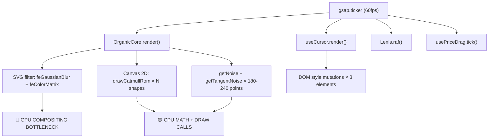

# 🔬 Аудит производительности studio-BLACK

> **Дата:** 23 июня 2026  
> **Цель:** Довести FPS до стабильных 60fps на десктопе и максимально близко к 60fps на мобильных. Без ущерба визуалу.

---

## Общая архитектурная карта нагрузки



---

## 🔴 КРИТИЧЕСКИЕ ПРОБЛЕМЫ (Наибольший импакт)

### 1. SVG фильтр `url(#goo)` на Canvas — главный убийца FPS

| | |
|---|---|
| **Файл** | [OrganicCore.vue:15](file:///c:/Users/BALDEJ/Desktop/studio-BLACK/app/components/OrganicCore.vue#L14-L15) |
| **Проблема** | CSS `filter: url(#goo)` применяется к `<canvas>`, который перерисовывается **каждый кадр** через `gsap.ticker`. Браузер обязан: (1) растеризовать Canvas, (2) применить `feGaussianBlur` с `stdDeviation=15-25` к КАЖДОМУ пикселю, (3) применить `feColorMatrix`, (4) скомпозитировать результат. На 1920×1080 при DPR 1.25 = ~2.4M пикселей × 2 прохода Gaussian = **~10M операций на пиксель**. Это **реальная причина лагов на первых 2 секциях**, потому что именно «Студия» (Hero) и «О нас» (About) используют высокие значения `gooBlur: 15-25` и `alphaMult: 25`. |
| **Доказательство** | `stateConfig.gooBlur` динамически меняется через GSAP, принудительно инвалидируя GPU-кэш SVG-фильтра каждый кадр. Строки [47-48](file:///c:/Users/BALDEJ/Desktop/studio-BLACK/app/components/OrganicCore.vue#L47-L48) обновляют `stdDeviation` и `values` ColorMatrix через `setAttribute()` **60 раз в секунду**. |
| **Приоритет** | 🔴 **КРИТИЧЕСКИЙ** — это ~60-70% всех лагов |

**Рекомендация:**

Заменить SVG-фильтр `url(#goo)` на **пост-обработку прямо в Canvas 2D** с помощью `ctx.filter`:

```typescript
// ВМЕСТО: SVG filter на элементе <canvas>
// ИСПОЛЬЗОВАТЬ: встроенный Canvas filter API

// В render():
ctx.save()
ctx.filter = `blur(${gooBlur}px)` // Нативный GPU-ускоренный blur
// ... рисуем формы ...
ctx.restore()

// Затем alpha threshold через getImageData/putImageData или второй canvas
```

**Альтернатива (минимальный рефактор):** Рисовать формы на **offscreen canvas**, применять blur к offscreen, и затем `drawImage()` результат на основной canvas. Это избавит от перекомпозиции SVG-фильтра DOM-элемента.

**Самый простой вариант без изменения визуала:** Кэшировать значения `stdDeviation` и `values`, и обновлять SVG-атрибуты **только при реальном изменении**, а не каждый кадр:

```typescript
// OrganicCore.vue render()
let lastGooBlur = -1
let lastAlphaMult = -1
let lastAlphaAdd = -1

const render = () => {
  // Обновляем SVG-фильтр ТОЛЬКО при изменении значений
  if (gooBlur !== lastGooBlur) {
    blurRef.value?.setAttribute('stdDeviation', gooBlur.toString())
    lastGooBlur = gooBlur
  }
  if (alphaMult !== lastAlphaMult || alphaAdd !== lastAlphaAdd) {
    colorMatrixRef.value?.setAttribute('values', `1 0 0 0 0  0 1 0 0 0  0 0 1 0 0  0 0 0 ${alphaMult} ${alphaAdd}`)
    lastAlphaMult = alphaMult
    lastAlphaAdd = alphaAdd
  }
  // ...
}
```

> [!IMPORTANT]
> Даже кэширование setAttribute даст лишь ~5% выигрыша, потому что **главная проблема в том, что SVG-фильтр пересчитывается каждый кадр из-за смены содержимого Canvas**. Реальное решение — перенести blur в Canvas API.

---

### 2. `will-change: filter` на Canvas — принудительная GPU-перекомпозиция

| | |
|---|---|
| **Файл** | [OrganicCore.vue:15](file:///c:/Users/BALDEJ/Desktop/studio-BLACK/app/components/OrganicCore.vue#L15) |
| **Проблема** | Стиль `will-change: filter` заставляет браузер создавать отдельный compositing layer для Canvas и **каждый кадр** пересчитывать фильтр в GPU. В сочетании с SVG goo-фильтром — это двойной удар. |
| **Приоритет** | 🔴 **КРИТИЧЕСКИЙ** — часть той же проблемы |

**Рекомендация:** Убрать `will-change: filter` и заменить на `will-change: transform` (который бесплатен для GPU). Или убрать `will-change` полностью — Canvas и так создаёт свой compositing layer.

---

### 3. `mix-blend-screen` на Canvas — ещё один compositing удар

| | |
|---|---|
| **Файл** | [OrganicCore.vue:14](file:///c:/Users/BALDEJ/Desktop/studio-BLACK/app/components/OrganicCore.vue#L14) |
| **Проблема** | `mix-blend-mode: screen` требует от GPU считывания пикселей нижележащего слоя, наложения Canvas, и записи результата. На полноэкранном элементе — это дорого. В комбинации с SVG-фильтром создаёт **тройное compositing: filter → blend → composite**. |
| **Приоритет** | 🟡 **ВЫСОКИЙ** — но уже оптимизировано для Safari (disableHeavyFilters) |

**Рекомендация:** Рассмотреть перенос blend mode внутрь Canvas (через `globalCompositeOperation`). Уже частично сделано для `isHole`, можно расширить.

---

### 4. Optimal Shift — O(N²) алгоритм на каждую синхронизацию

| | |
|---|---|
| **Файл** | [useOrganicSync.ts:151-165](file:///c:/Users/BALDEJ/Desktop/studio-BLACK/app/composables/organic/useOrganicSync.ts#L151-L165) |
| **Проблема** | При каждом вызове `syncShapes()` (переход между секциями) для **каждой** фигуры запускается O(N²) поиск лучшего смещения: цикл по `n` смещениям × `n` точек. При `n=240` (десктоп) = **57,600 итераций** на форму. При 7 формах в Price = **403,200 операций**. Это вызывает **ощутимый jank** в момент перехода между секциями. |
| **Приоритет** | 🔴 **КРИТИЧЕСКИЙ** — прямая причина лагов при навигации |

**Рекомендация:** 

1. **Сократить шаг поиска**: проверять каждый 4-й offset вместо каждого:
```typescript
for (let offset = 0; offset < n; offset += 4) { // вместо offset++
```
Это уменьшит нагрузку в **4 раза** с минимальной потерей качества (сдвиг на ±4 точки незаметен).

2. **Использовать предвычисленный кэш** для известных пар фигур (круг→квадрат и т.д.)

3. **Перенести в Web Worker** для тяжёлых переходов (опционально, максимальный эффект).

---

## 🟡 ВЫСОКИЙ ПРИОРИТЕТ

### 5. `UiKineticText` — DOM-взрыв: каждая буква = отдельный DOM-элемент

| | |
|---|---|
| **Файл** | [UiKineticText.vue](file:///c:/Users/BALDEJ/Desktop/studio-BLACK/app/components/UiKineticText.vue) |
| **Проблема** | Каждый символ текста оборачивается в `<span class="kinetic-char">`. Текст «Проектирование и разработка сайтов премиального уровня.» = **52 DOM-элемента** только для одной строки. На странице About их ~500. Каждый `mouseover` на символе запускает `gsap.fromTo` с `text-shadow` (3 слоя!) и `elastic.out` — **экстремально дорого для GPU**. |
| **Приоритет** | 🟡 **ВЫСОКИЙ** для мобильных (лишний DOM), средний для десктопа |

**Рекомендация для мобильных:**

На мобильных **полностью отключить** побуквенную разбивку, т.к. `text-shadow` эффект всё равно не используется (нет hover):

```vue
<template>
  <component :is="tag" class="kinetic-text inline-block" @mouseover="onMouseOver">
    <span v-if="isMobile" v-once>{{ text }}</span>
    <span v-else v-once>
      <!-- побуквенная разбивка только для десктопа -->
    </span>
  </component>
</template>
```

Это **уменьшит DOM на 1000+ элементов** на мобильных.

**Рекомендация для десктопа:**

Заменить `text-shadow` (который запускает layout+paint) на `transform` + `filter: drop-shadow()` (только composite):

```typescript
gsap.fromTo(target, 
  { x: spreadX * 0.4, y: spreadY * 0.4 },
  { x: 0, y: 0, duration: 1.2, ease: 'elastic.out(1, 0.4)', overwrite: 'auto' }
)
// Без text-shadow!
```

---

### 6. Количество точек на форму (180/240) — можно уменьшить на мобильных

| | |
|---|---|
| **Файл** | [organicStates.ts](file:///c:/Users/BALDEJ/Desktop/studio-BLACK/app/utils/organicStates.ts) — все функции состояний |
| **Проблема** | `pts = isMobile ? 180 : 240`. Каждая точка проходит через `getNoise()` + `getTangentNoise()` + пульс-математику + деформацию + масштаб = **~20 операций**. 180 точек × 20 = **3,600 операций на форму на кадр** на мобильных. |
| **Приоритет** | 🟡 **ВЫСОКИЙ** для мобильных |

**Рекомендация:** Уменьшить до `pts = isMobile ? 90 : 180`. На маленьких экранах (< 768px) разница между 90 и 180 точками **визуально незаметна** — Catmull-Rom сплайн интерполирует промежутки идеально гладко. Это даст **50% ускорение** рендера OrganicCore на мобильных.

---

### 7. `backdrop-invert` на ApproachContent (desktop) — крайне тяжёлый CSS

| | |
|---|---|
| **Файл** | [ApproachContent.vue:6](file:///c:/Users/BALDEJ/Desktop/studio-BLACK/app/components/sections/desktop/ApproachContent.vue#L6) |
| **Проблема** | `backdrop-invert` применяет инверсию цвета ко всем элементам **под** панелью (50% экрана). Браузер должен: считать все пиксели под панелью, инвертировать их, и скомпозитировать. Это **полноэкранная GPU-операция на каждый кадр**, пока OrganicCore анимируется под панелью. |
| **Приоритет** | 🟡 **ВЫСОКИЙ** — прямая причина лагов на секции «Наш Подход» |

**Рекомендация:**

Мобильная версия уже правильно использует `bg-white` вместо `backdrop-invert` (строка 11 mobile/ApproachContent.vue). **Применить такое же решение для десктопа**: использовать непрозрачный белый фон вместо backdrop-filter. OrganicCore рендерится в Canvas с `mix-blend-screen` поверх чёрного фона — белая панель даст тот же визуальный эффект инверсии, но **бесплатно для GPU**.

Если вы хотите сохранить именно backdrop-invert (для прозрачности), добавьте `will-change: backdrop-filter` только когда секция видна, и снимите его когда уходите.

---

### 8. `drawCatmullRom` — двойной вызов в Preloader phase

| | |
|---|---|
| **Файл** | [OrganicCore.vue:198-226](file:///c:/Users/BALDEJ/Desktop/studio-BLACK/app/components/OrganicCore.vue#L198-L226) |
| **Проблема** | В фазе Preloader (`isPreloading.value === true`) `drawCatmullRom()` вызывается **дважды** для одних и тех же точек: один раз на строке 198, и второй раз внутри clip-региона (строка 217) или повторно (строка 223). Catmull-Rom — тяжёлая операция (~6 операций bezierCurveTo × 240 точек = **1440 bezier-вызовов** удвоенных). |
| **Приоритет** | 🟡 **СРЕДНИЙ** — только первые 3.5 сек загрузки |

**Рекомендация:** Оптимизировать preloader phase:
- При `preloaderProgress >= 1` и `fillProgress <= 0` — рисовать форму **один раз**
- Кэшировать Path2D объект для повторного использования вместо повторного вызова drawCatmullRom

---

### 9. Множественные `gsap.ticker.add` — конкуренция за Main Thread

| | |
|---|---|
| **Файлы** | [OrganicCore.vue:287](file:///c:/Users/BALDEJ/Desktop/studio-BLACK/app/components/OrganicCore.vue#L287), [useCursor.ts:342](file:///c:/Users/BALDEJ/Desktop/studio-BLACK/app/composables/useCursor.ts#L342), [smooth-scroll.client.ts:35](file:///c:/Users/BALDEJ/Desktop/studio-BLACK/app/plugins/smooth-scroll.client.ts#L35), [usePriceDrag.ts:49](file:///c:/Users/BALDEJ/Desktop/studio-BLACK/app/composables/usePriceDrag.ts#L49) |
| **Проблема** | В тикере GSAP одновременно работают **4+ callback-а**: `render()` (OrganicCore), `render()` (Cursor), `rafCallback` (Lenis), `tick()` (PriceDrag). Все они выполняются **последовательно** в одном кадре. Если суммарное время превышает 16ms — frame drop. |
| **Приоритет** | 🟡 **СРЕДНИЙ** |

**Рекомендация:**
1. **usePriceDrag.tick()** — НЕ добавлять в тикер глобально. Добавлять только когда секция Price активна, убирать когда уходишь:
```typescript
on('section-change', (label) => {
  if (label === '[ Прайс ]') gsap.ticker.add(tick)
  else gsap.ticker.remove(tick)
})
```

2. **useCursor.render()** — уже оптимизирован (только для десктопа). Ок.

3. **Lenis rafCallback** — выполняется каждый кадр, но `lenis.raf()` с `smoothWheel: false, syncTouch: false` по сути ничего не делает (нет инерции). Можно сделать ленивым: вызывать только при активной анимации.

---

## 🟢 СРЕДНИЙ ПРИОРИТЕТ

### 10. `Shapes.forEach` — аллокации в горячем пути

| | |
|---|---|
| **Файл** | [OrganicCore.vue:120](file:///c:/Users/BALDEJ/Desktop/studio-BLACK/app/components/OrganicCore.vue#L120) |
| **Проблема** | `shape.points.map(...)` внутри `render()` создаёт **новый массив из 180-240 объектов** каждый кадр. При 1-7 формах = **240-1680 объектов × 60fps = до 100K объектов/секунду**. Это давит GC (сборщик мусора), который паузит Main Thread на ~1-3ms. |
| **Приоритет** | 🟢 **СРЕДНИЙ** |

**Рекомендация:** Использовать **pre-allocated буфер** вместо `.map()`:

```typescript
// Один раз выделить буфер
const noisyPointsBuffer: {x: number, y: number}[] = []

// В render():
// Вместо const noisyPoints = shape.points.map(...)
// Переиспользовать буфер:
if (noisyPointsBuffer.length < shape.points.length) {
  for (let j = noisyPointsBuffer.length; j < shape.points.length; j++) {
    noisyPointsBuffer.push({ x: 0, y: 0 })
  }
}
shape.points.forEach((p, j) => {
  // ... вычисления ...
  noisyPointsBuffer[j].x = nx_coord
  noisyPointsBuffer[j].y = ny_coord
})
drawCatmullRom(ctx, noisyPointsBuffer.slice(0, shape.points.length), true, tension)
```

---

### 11. `drawCatmullRom` — spread operator в горячем пути

| | |
|---|---|
| **Файл** | [shapeMath.ts:350](file:///c:/Users/BALDEJ/Desktop/studio-BLACK/app/utils/shapeMath.ts#L350) |
| **Проблема** | `const p = [...points]` + `p.unshift(...)` + `p.push(...)` — создаёт **полную копию массива** + 3 мутации на каждый вызов. При 7 формах × 60fps = **420 копий/секунду**. |
| **Приоритет** | 🟢 **СРЕДНИЙ** |

**Рекомендация:** Обращаться к точкам по индексу с оборачиванием, без копирования массива:

```typescript
export function drawCatmullRom(ctx: CanvasRenderingContext2D, points: {x: number, y: number}[], close = true, tension = 1) {
  const n = points.length
  if (n < 3) return
  
  ctx.beginPath()
  ctx.moveTo(points[0]!.x, points[0]!.y)
  
  const getPoint = close
    ? (i: number) => points[((i % n) + n) % n]!
    : (i: number) => points[Math.max(0, Math.min(n - 1, i))]!
  
  for (let i = 0; i < n; i++) {
    const p0 = getPoint(i - 1)
    const p1 = getPoint(i)
    const p2 = getPoint(i + 1)
    const p3 = getPoint(i + 2)
    
    const cp1x = p1.x + ((p2.x - p0.x) / 6) * tension
    const cp1y = p1.y + ((p2.y - p0.y) / 6) * tension
    const cp2x = p2.x - ((p3.x - p1.x) / 6) * tension
    const cp2y = p2.y - ((p3.y - p1.y) / 6) * tension
    
    ctx.bezierCurveTo(cp1x, cp1y, cp2x, cp2y, p2.x, p2.y)
  }
  
  if (close) ctx.closePath()
}
```

---

### 12. `resizeCanvas` — `currentDpr` как `ref` вызывает ненужную реактивность

| | |
|---|---|
| **Файл** | [OrganicCore.vue:37](file:///c:/Users/BALDEJ/Desktop/studio-BLACK/app/components/OrganicCore.vue#L37) |
| **Проблема** | `currentDpr` объявлен как `ref(1)`, но используется только в `render()` и `resizeCanvas()` — рендер-цикле. Реактивность для него не нужна, но Vue отслеживает его и тратит CPU на proxy-обёртку при каждом чтении (строки 59, 262, 270). |
| **Приоритет** | 🟢 **СРЕДНИЙ** |

**Рекомендация:** Заменить на обычную переменную:
```typescript
let currentDpr = 1  // вместо ref(1)
```

---

### 13. `mix-blend-difference` на Contact и Price секциях

| | |
|---|---|
| **Файлы** | [ContactContent.vue:2](file:///c:/Users/BALDEJ/Desktop/studio-BLACK/app/components/sections/desktop/ContactContent.vue#L2), [PriceContent.vue:41](file:///c:/Users/BALDEJ/Desktop/studio-BLACK/app/components/sections/desktop/PriceContent.vue#L41), [PriceContent.vue:70](file:///c:/Users/BALDEJ/Desktop/studio-BLACK/app/components/sections/desktop/PriceContent.vue#L70) |
| **Проблема** | `mix-blend-mode: difference` на больших контейнерах заставляет GPU пересчитывать бленд для всех пикселей. На секциях Contact и Price это **полноэкранный blend каждый кадр**. |
| **Приоритет** | 🟢 **СРЕДНИЙ** |

**Рекомендация:** Ок для статичного контента, но для анимированных секций лучше ограничить `mix-blend-difference` только текстовыми элементами, а не целыми секциями. Это уменьшит площадь пересчёта бленда с 100% до ~5% экрана.

---

### 14. Каскадная гидратация — таймеры перегружают Main Thread

| | |
|---|---|
| **Файл** | [index.vue:103-107](file:///c:/Users/BALDEJ/Desktop/studio-BLACK/app/pages/index.vue#L103-L107) |
| **Проблема** | 5 `setTimeout` с шагом 500-700ms запускают `v-if` гидратацию секций. Каждое включение создаёт DOM, запускает `onMounted`, инициализирует ScrollTrigger, GSAP-таймлайны и т.д. Это создаёт **пики нагрузки** именно в момент прелоадера, когда OrganicCore уже рендерится. |
| **Приоритет** | 🟢 **СРЕДНИЙ** |

**Рекомендация:** Увеличить интервалы или привязать гидратацию к `requestIdleCallback`:

```typescript
const hydrateNext = (setter: Ref<boolean>) => {
  if ('requestIdleCallback' in window) {
    requestIdleCallback(() => { setter.value = true }, { timeout: 2000 })
  } else {
    setTimeout(() => { setter.value = true }, 500)
  }
}
```

---

### 15. `useMouseSmudge` — requestAnimationFrame работает всегда

| | |
|---|---|
| **Файл** | [useMouseSmudge.ts](file:///c:/Users/BALDEJ/Desktop/studio-BLACK/app/composables/useMouseSmudge.ts) |
| **Проблема** | RAF loop (`updateLoop`) запускается при любом движении мыши и продолжает работать пока скорость не упадёт до нуля. Ок для десктопа, но на мобильных этот composable вообще не нужен (нет ховера), а он всё равно слушает events. |
| **Приоритет** | 🟢 **НИЗКИЙ** (уже проверяет `import.meta.server`, но не `isMobile`) |

**Рекомендация:** Добавить проверку на мобильные:
```typescript
export function useMouseSmudge() {
  if (import.meta.server) return
  // Добавить:
  if (typeof window !== 'undefined' && 'ontouchstart' in window && !window.matchMedia('(hover: hover)').matches) return
}
```

---

## 📱 МОБИЛЬНЫЕ ПРОБЛЕМЫ

### 16. OrganicCore на мобильных — продолжает полный рендер

| | |
|---|---|
| **Файл** | [OrganicCore.vue](file:///c:/Users/BALDEJ/Desktop/studio-BLACK/app/components/OrganicCore.vue) |
| **Проблема** | На мобильных OrganicCore работает **так же** как на десктопе: полный Canvas + SVG filter + gsap.ticker. Но мобильные состояния (Hero, About, Approach, Price, Contact) возвращают **пустой массив shapes** (`shapes: []`). Canvas каждый кадр очищается и ничего не рисует — но SVG-фильтр, `mix-blend-screen`, `will-change`, и GSAP ticker **продолжают работать**. Это **пустая трата ~5-8ms/кадр** на мобильных. |
| **Приоритет** | 🔴 **КРИТИЧЕСКИЙ для мобильных** |

**Рекомендация:**

```typescript
const render = () => {
  // Если shapes пусты — не тратить время на Canvas
  if (shapes.length === 0) return
  // ... остальной рендер
}
```

Кроме того, когда все мобильные состояния возвращают пустые shapes, Canvas **можно скрыть** через `display: none` на мобильных (или не монтировать OrganicCore вообще на мобильных через DeviceSwitch). Но это зависит от того, есть ли хотя бы одно мобильное состояние с shapes (Hero default state имеет shapes!).

> [!IMPORTANT]
> Проверьте: в [organicStates.ts](file:///c:/Users/BALDEJ/Desktop/studio-BLACK/app/utils/organicStates.ts) мобильные состояния About, Approach, Price, Contact возвращают пустые shapes, но **Default state** (Hero) возвращает сферу с `radius: 120`. Значит, на Hero мобильном OrganicCore активен. Оптимизируйте `render()` для empty shapes и уменьшите `pts` для мобильного Hero.

---

### 17. `DPR clamping` — слишком высокий для мобильных

| | |
|---|---|
| **Файл** | [OrganicCore.vue:262](file:///c:/Users/BALDEJ/Desktop/studio-BLACK/app/components/OrganicCore.vue#L262) |
| **Проблема** | `Math.min(baseDpr, 1.5)` — на iPhone 14 Pro (DPR 3.0) это ограничивает до 1.5, но ширина экрана 393 × 1.5 = **~590px Canvas**. Для одной органической формы из 180 точек — это уже избыточно. |
| **Приоритет** | 🟢 **СРЕДНИЙ** |

**Рекомендация:** Уменьшить до `Math.min(baseDpr, 1.0)` для мобильных. Sвизуально разница между DPR 1.0 и 1.5 на белой органической форме **незаметна** (у неё нет тонких линий или мелких деталей).

---

### 18. CSS `transition-all` — провоцирует Layout Thrashing

| | |
|---|---|
| **Файлы** | Множественные мобильные компоненты используют `transition-all duration-700` |
| **Проблема** | `transition-all` заставляет браузер отслеживать **все** CSS-свойства элемента для анимации, даже те, которые не меняются. На мобильных с ограниченным CPU это вызывает лишние layout recalculations. |
| **Приоритет** | 🟢 **НИЗКИЙ** — но легко исправить |

**Рекомендация:** Заменить `transition-all` на конкретные свойства: `transition-[opacity,transform]` или `transition-[opacity,transform,color]`.

---

## 📊 Сводная таблица приоритетов

| # | Проблема | Файл | Десктоп | Мобильные | Сложность |
|---|---------|------|---------|-----------|-----------|
| 1 | SVG goo filter на Canvas | OrganicCore.vue | 🔴 | 🔴 | Высокая |
| 2 | will-change: filter | OrganicCore.vue | 🔴 | 🔴 | Минимальная |
| 3 | mix-blend-screen на Canvas | OrganicCore.vue | 🟡 | 🟡 | Средняя |
| 4 | O(N²) Optimal Shift | useOrganicSync.ts | 🔴 | 🟡 | Минимальная |
| 5 | UiKineticText DOM-взрыв | UiKineticText.vue | 🟡 | 🔴 | Низкая |
| 6 | 180/240 точек на форму | organicStates.ts | 🟢 | 🔴 | Минимальная |
| 7 | backdrop-invert | ApproachContent.vue | 🔴 | — | Средняя |
| 8 | Двойной drawCatmullRom | OrganicCore.vue | 🟡 | 🟡 | Низкая |
| 9 | 4+ ticker callbacks | Множественные | 🟡 | 🟡 | Низкая |
| 10 | .map() аллокации в render | OrganicCore.vue | 🟢 | 🟡 | Средняя |
| 11 | spread в drawCatmullRom | shapeMath.ts | 🟢 | 🟡 | Низкая |
| 12 | ref() для currentDpr | OrganicCore.vue | 🟢 | 🟢 | Минимальная |
| 13 | mix-blend-difference | Contact/Price | 🟢 | 🟢 | Низкая |
| 14 | setTimeout гидратация | index.vue | 🟡 | 🟡 | Низкая |
| 15 | useMouseSmudge на мобильных | useMouseSmudge.ts | — | 🟢 | Минимальная |
| 16 | Пустой render на мобильных | OrganicCore.vue | — | 🔴 | Минимальная |
| 17 | DPR 1.5 на мобильных | OrganicCore.vue | — | 🟡 | Минимальная |
| 18 | transition-all | Мобильные секции | — | 🟢 | Минимальная |

---

## 🚀 Рекомендованный план действий

### Фаза 1: Quick Wins (1-2 часа, ~40% улучшение)

1. **[Критический]** Кэширование `setAttribute` для SVG filter + убрать `will-change: filter` → `will-change: transform`
2. **[Критический]** Early return в `render()` при пустых shapes (мобильные)
3. **[Критический]** Уменьшить шаг Optimal Shift с 1 до 4 (`offset += 4`)
4. **[Высокий]** Уменьшить `pts` на мобильных: `180 → 90`
5. **[Высокий]** UiKineticText: плоский текст на мобильных (без побуквенной разбивки)
6. **[Средний]** DPR clamping: `1.5 → 1.0` для мобильных

### Фаза 2: Средний рефактор (3-5 часов, ~30% улучшение)

7. **[Критический]** Перенести SVG goo filter → Canvas API (`ctx.filter = 'blur(...)'`)
8. **[Высокий]** Заменить `backdrop-invert` → `bg-white` на десктоп ApproachContent
9. **[Средний]** Pre-allocated буфер для `noisyPoints` (без `.map()`)
10. **[Средний]** Переписать `drawCatmullRom` без spread/copy
11. **[Средний]** Ленивые ticker callbacks (Price tick только на Price-секции)

### Фаза 3: Глубокая оптимизация (опционально)

12. Перенести Optimal Shift в Web Worker
13. `OffscreenCanvas` для рендера OrganicCore
14. Замена `mix-blend-difference` на CSS-переменные для инвертирования текста

---

## ✅ Что уже сделано хорошо

| Элемент | Оценка |
|---------|--------|
| `shallowReactive` для shapes массива | ✅ Отлично — избегает глубокой реактивности |
| Module-scoped variables в useMouseVelocity | ✅ Отлично — нет реактивности в горячих путях |
| `disableHeavyFilters` для Safari/iOS | ✅ Отлично — правильный device split |
| Auto-stop RAF в useMouseVelocity | ✅ Отлично — не тратит CPU когда мышь стоит |
| IntersectionObserver вместо ScrollTrigger на мобильных | ✅ Отлично — намного легче для CPU |
| Каскадная ленивая гидратация через `v-if` | ✅ Хорошо — разгружает первый рендер |
| `Strict-Cleanup` во всех компонентах | ✅ Отлично — нет утечек памяти |
| `overwrite: 'auto'` на всех GSAP-твинах | ✅ Отлично — предотвращает конфликты |
| Кэширование SVG path в `svgPathCache` | ✅ Отлично — тяжёлый парсинг один раз |

---

> [!NOTE]
> Все рекомендации **не затрагивают визуал**. Фаза 1 может быть реализована за пару часов и даст ощутимый результат на обеих платформах. Фаза 2 требует более аккуратного рефактора Canvas-пайплайна, но даёт наибольший выигрыш для десктопа.
